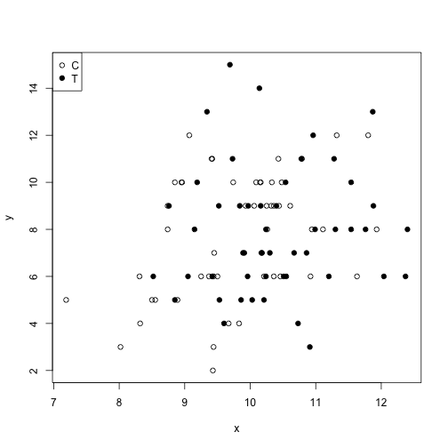
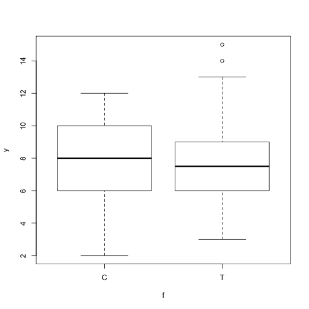
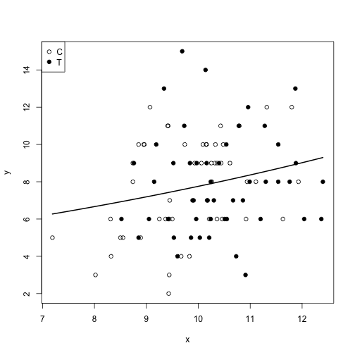
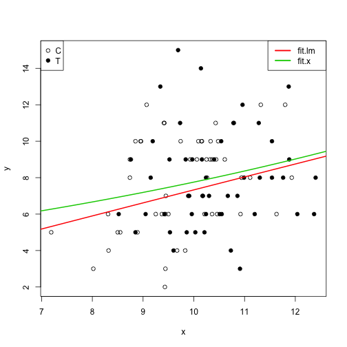
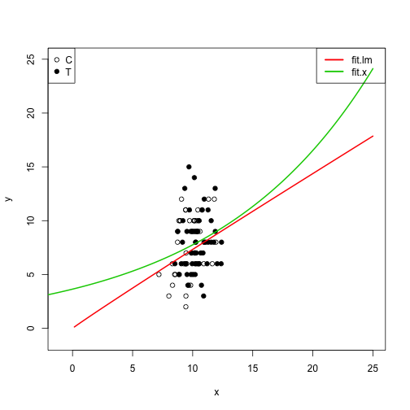

一般化線形モデル -ポアソン回帰-
========================================================
* データ解析のための統計モデリング入門
    * http://www.amazon.co.jp/dp/400006973X
        * p.40~65 3章


```r
# http://hosho.ees.hokudai.ac.jp/~kubo/ce/IwanamiBook.html
d<-read.csv("~/Desktop/data_modeling_tutorial/chap3/data3a.csv")
str(d)
```

```
## 'data.frame':	100 obs. of  3 variables:
##  $ y: int  6 6 6 12 10 4 9 9 9 11 ...
##  $ x: num  8.31 9.44 9.5 9.07 10.16 ...
##  $ f: Factor w/ 2 levels "C","T": 1 1 1 1 1 1 1 1 1 1 ...
```

```r
summary(d)
```

```
##        y               x         f     
##  Min.   : 2.00   Min.   : 7.19   C:50  
##  1st Qu.: 6.00   1st Qu.: 9.43   T:50  
##  Median : 8.00   Median :10.15         
##  Mean   : 7.83   Mean   :10.09         
##  3rd Qu.:10.00   3rd Qu.:10.69         
##  Max.   :15.00   Max.   :12.40
```


```r
# データ全体を眺める
plot(d[,c(2,1)],pch=c(21,19)[d$f])
legend("topleft",legend=c("C","T"),pch=c(21,19))
```

 

```r
# ggplot2ライブラリでの表示
# library('ggplot2')
# qplot(data=d,y=y,x=x,col=f)

# 施肥処理でグループ分けした箱ひげ図
plot(d[,c(3,1)])
```

 

```r
# 施肥処理でグループ分けした箱ひげ図(ggplot2)
# qplot(data=d,y=y,x=f,col=f,geom='boxplot')

# ポアソン回帰 説明変数 数量型
fit.x <- glm(y~x,data=d,family=poisson)
print(fit.x) #最尤推定値 概要の表示
```

```
## 
## Call:  glm(formula = y ~ x, family = poisson, data = d)
## 
## Coefficients:
## (Intercept)            x  
##      1.2917       0.0757  
## 
## Degrees of Freedom: 99 Total (i.e. Null);  98 Residual
## Null Deviance:	    89.5 
## Residual Deviance: 85 	AIC: 475
```

```r
summary(fit.x) # 詳細の表示
```

```
## 
## Call:
## glm(formula = y ~ x, family = poisson, data = d)
## 
## Deviance Residuals: 
##    Min      1Q  Median      3Q     Max  
## -2.368  -0.735  -0.177   0.699   2.376  
## 
## Coefficients:
##             Estimate Std. Error z value Pr(>|z|)    
## (Intercept)   1.2917     0.3637    3.55  0.00038 ***
## x             0.0757     0.0356    2.13  0.03358 *  
## ---
## Signif. codes:  0 '***' 0.001 '**' 0.01 '*' 0.05 '.' 0.1 ' ' 1
## 
## (Dispersion parameter for poisson family taken to be 1)
## 
##     Null deviance: 89.507  on 99  degrees of freedom
## Residual deviance: 84.993  on 98  degrees of freedom
## AIC: 474.8
## 
## Number of Fisher Scoring iterations: 4
```

* Estimate : 推定値
* Std.Error : 標準誤差(standard error,SE)の推定値
* z value : z値 最尤推定値/SE Wald統計量
* Pr(>|z|) : z値を平均,SEを1の正規分布における、マイナス無限大からゼロまでの値をとる確率。P値と考える場合も。

```r
logLik(fit.x) # 最大対数尤度　あてはまりの良さ 大きい値であるほうが良い。
```

```
## 'log Lik.' -235.4 (df=2)
```

* df:自由度(degrees of freedom) 最尤推定した値は２個という意味。

```r
# ポアソン回帰モデルと実測値の図示
plot(d[,c(2,1)],pch=c(21,19)[d$f])
legend("topleft",legend=c("C","T"),pch=c(21,19))
xx <- seq(min(d$x),max(d$x),length=100)
lines(xx,exp(1.29+0.0757*xx),lwd=2)
```

 

```r
# ポアソン回帰モデルと実測値の図示(predict関数)
yy <- predict(fit.x,newdata=data.frame(x=xx),type='response')
plot(d[,c(2,1)],pch=c(21,19)[d$f])
legend("topleft",legend=c("C","T"),pch=c(21,19))
lines(xx,yy,lwd=2)
```

 

```r
# ポアソン回帰 説明変数 因子型
fit.f <- glm(y~f,data=d,family=poisson)
summary(fit.f)
```

```
## 
## Call:
## glm(formula = y ~ f, family = poisson, data = d)
## 
## Deviance Residuals: 
##     Min       1Q   Median       3Q      Max  
## -2.4751  -0.6994   0.0426   0.7247   2.2520  
## 
## Coefficients:
##             Estimate Std. Error z value Pr(>|z|)    
## (Intercept)   2.0516     0.0507   40.46   <2e-16 ***
## fT            0.0128     0.0715    0.18     0.86    
## ---
## Signif. codes:  0 '***' 0.001 '**' 0.01 '*' 0.05 '.' 0.1 ' ' 1
## 
## (Dispersion parameter for poisson family taken to be 1)
## 
##     Null deviance: 89.507  on 99  degrees of freedom
## Residual deviance: 89.475  on 98  degrees of freedom
## AIC: 479.3
## 
## Number of Fisher Scoring iterations: 4
```

```r
logLik(fit.f) # 最大対数尤度
```

```
## 'log Lik.' -237.6 (df=2)
```

```r
# ポアソン回帰 説明変数 数量型＋因子型
fit.all <- glm(y~x+f,data=d,family=poisson)
summary(fit.all)
```

```
## 
## Call:
## glm(formula = y ~ x + f, family = poisson, data = d)
## 
## Deviance Residuals: 
##    Min      1Q  Median      3Q     Max  
## -2.398  -0.734  -0.202   0.679   2.432  
## 
## Coefficients:
##             Estimate Std. Error z value Pr(>|z|)    
## (Intercept)   1.2631     0.3696    3.42  0.00063 ***
## x             0.0801     0.0370    2.16  0.03062 *  
## fT           -0.0320     0.0744   -0.43  0.66703    
## ---
## Signif. codes:  0 '***' 0.001 '**' 0.01 '*' 0.05 '.' 0.1 ' ' 1
## 
## (Dispersion parameter for poisson family taken to be 1)
## 
##     Null deviance: 89.507  on 99  degrees of freedom
## Residual deviance: 84.808  on 97  degrees of freedom
## AIC: 476.6
## 
## Number of Fisher Scoring iterations: 4
```

```r
logLik(fit.all) # 最大対数尤度
```

```
## 'log Lik.' -235.3 (df=3)
```

* p.65

> 応答変数$y$を$\log y$のように変数変換して直線回帰することと、ポアソン回帰はまったく別ものであることに注意してください。試してみればわかりますが、両者の推定結果は一致しません。


```r
fit.lm <- lm(log(y)~log(x),data=d)
summary(fit.lm)
```

```
## 
## Call:
## lm(formula = log(y) ~ log(x), data = d)
## 
## Residuals:
##     Min      1Q  Median      3Q     Max 
## -1.2416 -0.2258 -0.0174  0.2817  0.7469 
## 
## Coefficients:
##             Estimate Std. Error t value Pr(>|t|)   
## (Intercept)   -0.246      0.826   -0.30   0.7663   
## log(x)         0.972      0.358    2.72   0.0078 **
## ---
## Signif. codes:  0 '***' 0.001 '**' 0.01 '*' 0.05 '.' 0.1 ' ' 1
## 
## Residual standard error: 0.36 on 98 degrees of freedom
## Multiple R-squared:  0.07,	Adjusted R-squared:  0.0606 
## F-statistic: 7.38 on 1 and 98 DF,  p-value: 0.00779
```

```r
xx <- seq(-5,25,length=100)
yy.lm <- predict(fit.lm,newdata=data.frame(x=xx),type='response')
yy.x <- predict(fit.x,newdata=data.frame(x=xx),type='response')
plot(d[,c(2,1)],pch=c(21,19)[d$f])
legend("topleft",legend=c("C","T"),pch=c(21,19))
lines(xx,exp(yy.lm),lwd=2,col=2)
lines(xx,yy.x,lwd=2,col=3)
legend("topright",legend=c("fit.lm","fit.x"),lwd=2.5,col=c(2,3))
```

 

```r
# 範囲を広げて表示
plot(d[,c(2,1)],pch=c(21,19)[d$f],xlim=c(-1,25),ylim=c(-1,25))
legend("topleft",legend=c("C","T"),pch=c(21,19))
lines(xx,exp(yy.lm),lwd=2,col=2)
lines(xx,yy.x,lwd=2,col=3)
legend("topright",legend=c("fit.lm","fit.x"),lwd=2.5,col=c(2,3))
```

 


